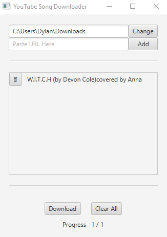

# youtube-download

A simple GUI application that allows you to build up a list of songs, by providing URLs from YouTube, and then download them all with a click of a button, to a directory of your choice.

## Dependencies:

1. Java SE 17 (JDK)
2. Install yt-dlp: winget install yt-dlp --accept-package-agreements (Windows download here: https://github.com/yt-dlp/yt-dlp/wiki/Installation#third-party-package-managers)
3. FFMPEG - https://ffmpeg.org/download.html (ONLY IF YOU WANT MP3's AND NOT M4A OUTPUT FILES)

## Instructions for the first time you run this:

1. Double-click the .JAR file. It will create the "run.bat" file. Close the window that opened.
2. Now you must always use the "run.bat" file to open the application. 
3. IMPORTANT: Run the bat as an administrator or the songs will not download.
4. OPTIONAL: You can create a shortcut of the "run.bat" file, right click and choose Properties, Advanced, check mark "Run as Administrator". Now you only have to double-click the shortcut of "run.bat" for all future usage

## Instructions for normal usage:
1. Regardless of whether you created a shortcut or not, you need to run this as an administrator as it runs an elevated command. 
    
    a. No Shortcut: Right click the "run.bat" and "Run As Administrator"
    
    b. Shortcut: If setup correctly, then you simply double click going forward and you're good to go!

2. Inside the first textfield you specify the path for downloaded files to output to. You can click the "Change" button to pick it using a File Chooser
3. Inside the second textfield you paste in URLs gotten from YouTube and click "Add". It will then add your song to the list below
4. Once you have all the songs added you can click "Download" at the bottom and they will start downloading. Progress can be confirm with the "Progress" label

## Example:

